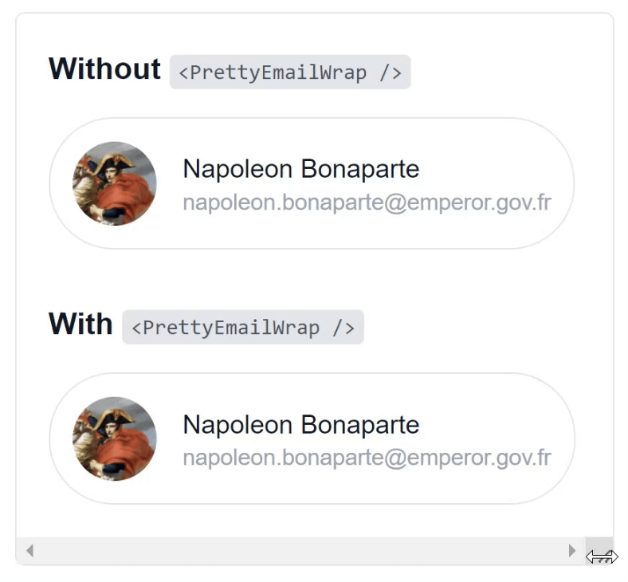

# react-pretty-email-wrap

_Allow emails to wrap in a human-readable way_


## Why?

Browsers treat email addresses as single words, which can cause horizontal overflow on mobile devices. This component resolves the issue by allowing email addresses to wrap naturally, breaking the text after special characters like `@` and `.` for better readability.

Try it yourself on this [demo page](https://johanmouchet.github.io/react-pretty-email-wrap/).



## Install

```
npm i react-pretty-email-wrap
```

`react-pretty-email-wrap` requires `react` and `react-dom` as peer dependencies.

## How does it work?

The component takes a `string` and insert [Word Break Opportunity tags](https://developer.mozilla.org/en-US/docs/Web/HTML/Element/wbr) (`<wbr />`) to help it wrap in a human readable way.

## Usage

### Input

```jsx
<PrettyEmailWrap>name@domain.com</PrettyEmailWrap>
```

### Output

```html
name<wbr />@domain.<wbr />com
```

# Development

## npm Scripts

In the project directory, you can `npm run`:

- `dev`: Starts up a development server with hot module replacement
- `test`: Runs the test suite
- `lint`: Runs the [ESLint](https://eslint.org/) linter
- `build:lib`: Build `react-pretty-email-wrap`, ready to be published
- `build:docs`: Build the documentation

## Deployment

1. Update `CHANGELOG.md` following the [Keep a Changelog](https://keepachangelog.com/en/1.0.0/) format
2. Run `npm run deploy`
3. Update `package.json` and `package-lock.json` using [semver](https://semver.org/): `"version": "<semver>"`
4. Once merged to `master`, tag: `git tag <semver>`
5. Publish to npm: `npm publish`

## Contribution

Contribution is welcomed, feel free to raise an issue or PR.
